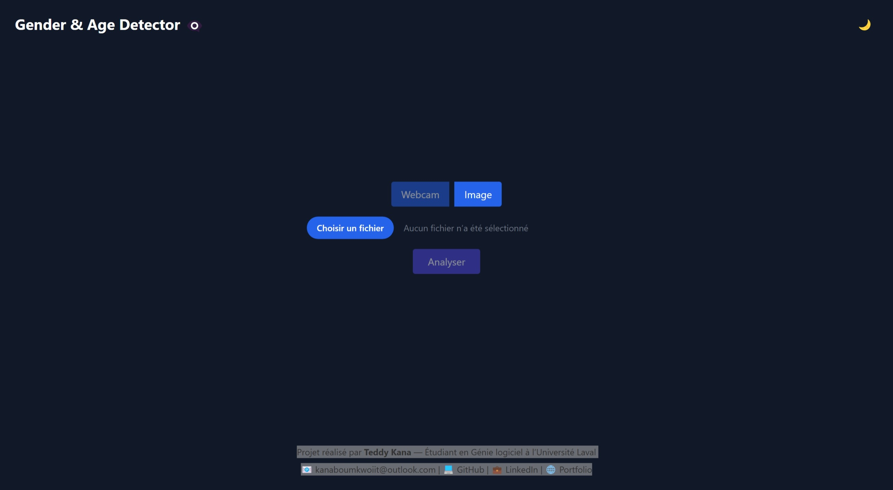

# 🧠 Gender & Age Detection App

Bienvenue dans le projet **Gender & Age Detection**, une application complète permettant de prédire le **genre** et l'**âge estimé** d'une personne à partir d'une **image** ou via la **webcam en temps réel**. Elle utilise **OpenCV (Caffe)** pour les modèles de détection, **Flask** pour l’API backend, et **React + Tailwind CSS** pour l’interface utilisateur moderne.

---

## 🔗 Démo en ligne

🌐 Application Web : [https://gender-age-app-j0yb0y28.vercel.app/](https://gender-age-app-j0yb0y28.vercel.app/) *(à remplacer par ton lien Vercel)*

---

## 📁 Structure du projet

```
gender-age-app/
├── backend/                   # API Flask + fichiers de modèles
│   ├── models/                # Modèles Caffe (age, gender, face detection)
│   ├── app.py                 # API /predict
│   └── detector.py            # Logique de détection OpenCV
├── frontend/                  # Application React + Tailwind
│   ├── public/                # favicon, index.html
│   └── src/                   # WebcamCapture, App.js, styles
```

---

## ✨ Fonctionnalités

- 🎥 Détection via **webcam** ou **upload d’image**
- 🔎 Prédiction du **genre** (`Male`, `Female`) et de la **tranche d'âge**
- 🌙 Interface claire/sombre avec toggle
- 📜 Historique local des prédictions
- 📂 Option pour stopper ou reprendre la webcam
- 🦶 Footer personnalisé avec infos de l’auteur
- 🚀 Déployé en ligne avec Vercel + Render

---

## 🚀 Installation locale

### 1. Cloner le projet

```bash
git clone https://github.com/J0YB0Y28/gender-age-app.git
cd gender-age-app
```

### 2. Backend : configuration Python + Flask

```bash
cd backend
python -m venv venv
source venv/bin/activate        # (Linux/Mac) ou venv\Scripts\activate (Windows)
pip install -r requirements.txt
python app.py                   # Lancement du serveur Flask
```

### 3. Frontend : configuration React

```bash
cd frontend
npm install
npm run dev                     # Lancement du frontend React
```

---

## 🖼️ Modèles utilisés

Les modèles Caffe suivants sont utilisés :

- `age_net.caffemodel` + `age_deploy.prototxt`
- `gender_net.caffemodel` + `gender_deploy.prototxt`
- `opencv_face_detector.pb` + `opencv_face_detector.pbtxt`

> Ces modèles ont été pré-entraînés par l'équipe OpenCV et sont publics.

---

## 🛰️ Déploiement

- 🎯 Backend Flask : déployé sur [Render](https://render.com)
- 🎯 Frontend React : déployé sur [Vercel](https://vercel.com)

---

## 🙌 Auteur

Projet réalisé par **Teddy Kana**  
📧 Contact : [kanaboumkwoiit@outlook.com](mailto:kanaboumkwoiit@outlook.com)  
🔗 [Portfolio](https://j0yb0y28.github.io/portfolio/) · [GitHub](https://github.com/J0YB0Y28) · [LinkedIn](https://www.linkedin.com/in/teddy-kana-6a26832b9/)

---

## ⭐ Technologies utilisées

- `OpenCV` pour la détection faciale
- `Flask`, `Flask-CORS` pour l’API backend
- `React`, `Tailwind CSS` pour l’UI
- `Vercel` et `Render` pour l’hébergement

---

## 📸 Aperçu de l'interface



---

## ✅ Améliorations futures ?

- [ ] Ajout de statistiques détaillées (graphiques) ? 
- [ ] Optimisation des performances webcam ?
- [ ] Support multi-visages ?
- [ ] Connexion à une base de données pour logs / utilisateurs ?
¯\\_(ツ)_/¯

---
